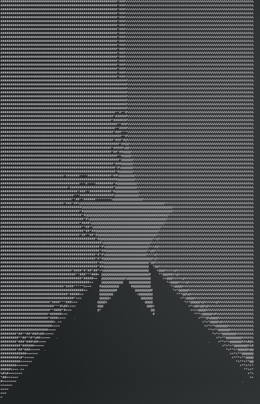

# Python Ascii Art Generator

## Description

Ascii art generator with a scale of 10 different characters

--------
## Usage Example

Here is a quick example of how to use it

```
./generator example.png
cat result.txt
```



--------
## Installation

```
git clone https://github.com/Noblerie/ascii_art_generator.git
cd ascii_art_generator
pip -r install requirements.txt
```